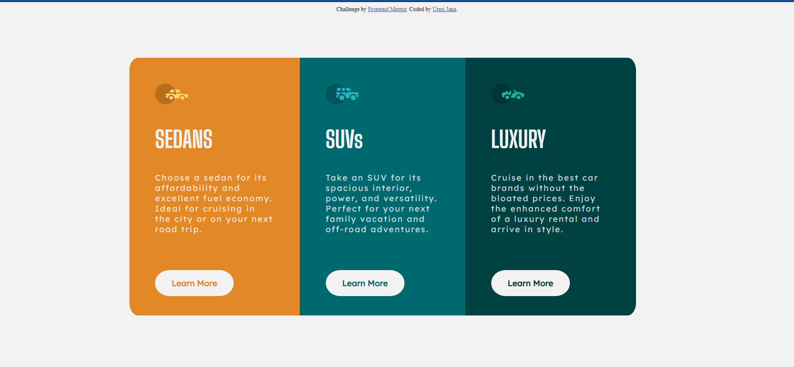

# Frontend Mentor - 3-column preview card component solution

This is a solution to the [3-column preview card component challenge on Frontend Mentor](https://www.frontendmentor.io/challenges/3column-preview-card-component-pH92eAR2-). Frontend Mentor challenges help you improve your coding skills by building realistic projects. 

## Table of contents

- [Overview](#overview)
  - [The challenge](#the-challenge)
  - [Screenshot](#screenshot)
  - [Links](#links)
- [My process](#my-process)
  - [Built with](#built-with)
  - [Continued development](#continued-development)
  - [Useful resources](#useful-resources)
- [Author](#author)

## Overview

### The challenge

Users should be able to:

- View the optimal layout depending on their device's screen size
- See hover states for interactive elements

### Screenshot

A screenshot of the solution I made.

### Links

- Solution URL: [Add solution URL here](https://your-solution-url.com)
- Live Site URL: https://urmi-jana.github.io/3-column-preview-card-project

## My process

### Built with

- Semantic HTML5 markup
- CSS custom properties

### Continued development

I would like to further work on:
1. Hoverable buttons
2. Optimizing the display for mobile devices

### Useful resources

- [Rounded Buttons](https://freefrontend.com/css-buttons/) - This  helped in creating rounded buttons. I really liked this pattern and will use it going forward.

## Author

- Frontend Mentor - [@Urmi-Jana](https://www.frontendmentor.io/profile/Urmi-Jana)
